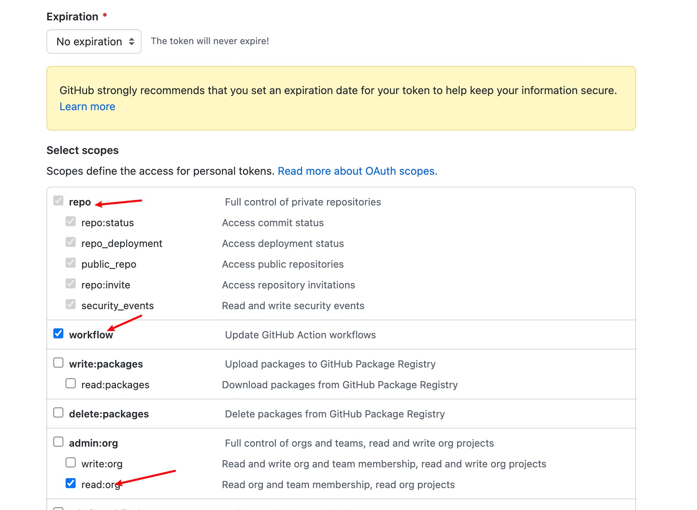

# Git使用教程
## 1.Github创建仓库

## 2.下载git
macos: `brew install git`
windows: [Git官网](https://git-scm.com/downloads)
## 3.配置ssh密钥
参见[Github官网教程](https://docs.github.com/cn/authentication/connecting-to-github-with-ssh/adding-a-new-ssh-key-to-your-github-account)
## 4.安装并配置GitHub CLI
参见[GitHub官网教程 GitHub CLI](https://docs.github.com/cn/get-started/getting-started-with-git/caching-your-github-credentials-in-git)
最后若选择粘贴认证口令，则需进行第5步
## 5.配置个人口令
参见[Github官网教程](https://docs.github.com/cn/authentication/keeping-your-account-and-data-secure/creating-a-personal-access-token)
**注意**:
1. 一定要复制最后生成的口令，**只会显示一次**
2. 选择范围时至少要勾选如下选项
   